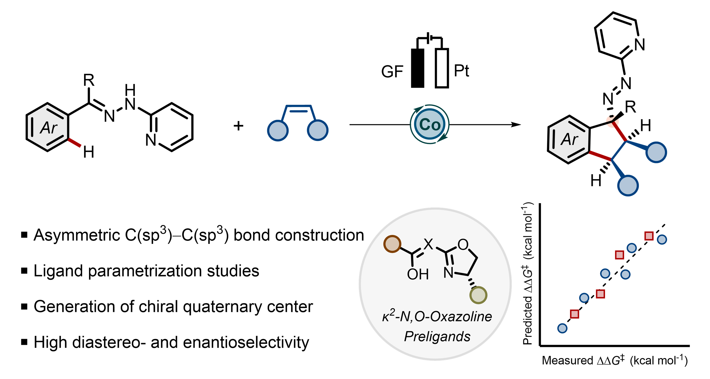

# Ligand parameterization
This is a data and code repository for the following manuscript:<br>
"Parametrization of <i>κ</i><sup>2</sup>-<i>N,O</i>-Oxazoline Preligands for Enantioselective Cobaltaelectro-catalyzed C–H Activations".

<p align="center">
  
</p>

Last updated on Mar 06, 2025

## Overview
The data file and script notebooks should be present in the same directory. 

Notebook 1 (nb1_MVLR_analysis.ipynb):
- Ligand feature analysis: Box-plot, and Pearson correlation
- MVLR model screening and sorting using the "Best subset selection" method
- Prediction performance visualization
- Performance summary plot

Notebook 2 (nb2_univariate_reactivity_analysis.ipynb):
- Univariate reactivity classification for selected features


# Packages requirements
The following packages were present during code development in the Google Colab notebooks. Use of the same versions is recommended to reproduce the results.
```
python = 3.10.12
numpy = 1.25.2  
pandas = 2.0.3 
matplotlib = 3.7.1
scipy = 1.11.4 
seaborn = 0.13.1 
sklearn = 1.2.2  
```

## How to cite
The code provided here is released under the MIT license. Commercial use, modification, and private use are all permitted. Please use the following citation to acknowledge this workflow:

```
@article{doi:10.1021/acscatal.5c00250,
author = {Dana, Suman and Pandit, Neeraj Kumar and Boos, Philipp and von Münchow, Tristan and Peters, Sven Erik and Trienes, Sven and Haberstock, Laura and Herbst-Irmer, Regine and Stalke, Dietmar and Ackermann, Lutz},
title = {Parametrization of κ2-N,O-Oxazoline Preligands for Enantioselective Cobaltaelectro-Catalyzed C–H Activations},
journal = {ACS Catalysis},
volume = {15},
pages = {4450-4459},
year = {2025},
doi = {10.1021/acscatal.5c00250},
URL = {https://doi.org/10.1021/acscatal.5c00250},
eprint = {https://doi.org/10.1021/acscatal.5c00250}
}
```
